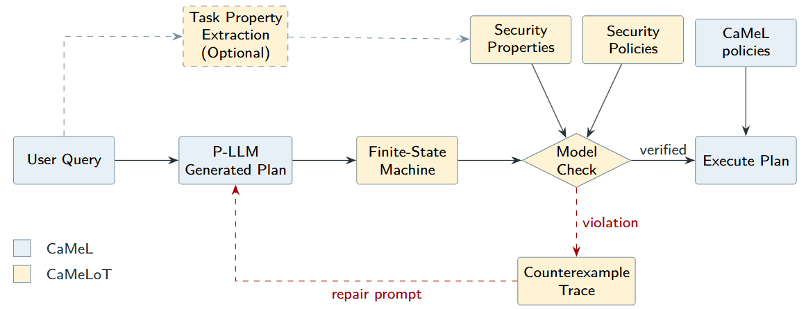

# Extending CaMeL with Temporal Logics

The goal of this project is to extend the CaMeL framework with temporal properties. In effect, this is a wrapper that enforces a set of properties via static analysis alongside CaMeL's runtime property enforcement.

For more information see the paper on arxiv (comming soon)

## Architecture


## Project file overview

The CaMeLoT extension lives in `src/camel/ext/` (the verification pipeline), `tests/test_ctl/` (unit tests) and `evaluation/` (the experiments reported in the paper).

```
ctl_camel/
├── src/camel/ext/                          # CaMeLoT: the CTL verification extension
│   ├── README.MD                           # CaMeLoT core modules
│   ├── nuxmv_runner.py                     # Run NuXMV, parse counterexamples, build error messages
│   ├── ...                                 # Build an FSM with provenance tracking from regions
│   └── ctl_policies/                       # CTL security policies + tool signatures, per suite
│       ├── __init__.py                     # Policy registry / suite lookup
│       ├── banking.py
│       ├── slack.py
│       ├── travel.py
│       ├── workspace.py
│       └── soc.py                          
├── tests/test_ctl/                         # Phase 0 unit tests
└── evaluation/                             # Experiments reported in the paper
    ├── README.md                           # Full layout + reproduction instructions
    ├── utils_evaluation.py                 # Shared experiment helpers
    ├── phase0_unit_testing/
    ├── phase1_translation/                 # CaMeL policy → CTL property translation notes
    ├── phase2_benign_tasks/
    └── phase3_ctl_expressiveness/
```

## CaMeL

CaMeL is a policy enforcement framework that combines a dual LLM architecture with a set of _capability_-based policies. The combination of these two defences aim to prevent attacked from manipulating data-flow and control-flow via indirect prompt injection. However, CaMeL exclusively provides runtime protection; it does not, by default, maintain a detailed notion of state beyond taint tracking. Everything in this subsection is provided by the original CaMeL team and our work does not alter it.

### Dual LLM architecture

CaMeL restricts data-flow from untrusted sources of data by relying on two LLMs: a Privileged LLM (or P-LLM) and a Quarantined LLM (or Q-LLM). The P-LLM is responsible for writing agentic plans --- consisting of short scripts of Python code --- and for executing the plan's tool calls. Importantly, the P-LLM's code is sent to an custom interpreter which only accepts agentic plans that use a restricted subset of Python. If the P-LLMs code violates this, the interpreter outputs a detailed error which is sent to the P-LLM, beginning a repair loop. When interacting with untrusted data sources, the P-LLM is forced (Note: forced might be too strong of a word. I think this is 'enforced' via a sternly worded system prompt) to access such data via the Q-LLM. The Q-LLM extracts just the necessary information from the untrusted data source: for instance, if the user has instructed the CaMeL system to read an email containing a meeting invite and the forward the details to a third-party, the Q-LLM will be forced to respond as {meeting_time: "tomorrow, 10am", "meeting_location": "Room 5.05"}, which will be treated as a set of variables for the P-LLM to work with.

### Capability-based Policies

The CaMeL system tags variables with metadata representing capabilities. For instance, an email from an external data source can be tagged with metadata stating that the data is untrusted and stating which tools can 'read' the email. Based on this metadata, CaMeL's security policies, alongside its interpreter, track which variables are valid inputs to tools and how the tool should update the metadata fields following execution.

## AST

The AST module (`cast.py`) parses P-LLM generated Python code into a structured representation of control flow regions. It uses Python's built-in `ast` module to traverse the syntax tree and identifies four types of regions:

1. **Tool calls**: Function calls to available tools, extracting the tool name, target variables, and argument expressions
2. **Assignments**: Variable assignments, tracking which variables are defined and what expressions they depend on
3. **Loops**: For-loops over iterables, identifying the loop variable, iterable, and body regions
4. **Conditionals**: If-else branches, extracting the condition and regions for each branch

For each region, the parser tracks variable dependencies at argument granularity. This means that for a tool call like `send_message(recipient, body)`, we record not just that the tool was called, but which specific variables appear in the `recipient` and `body` arguments.

The output is a JSON structure with a list of regions, where each region includes its type, metadata (e.g., tool name, variables), and for compound regions (loops, conditionals), nested sub-regions. This structured representation is then fed into the state machine builder for provenance analysis.

## State Machine

The state machine module (`state_machine.py`) takes the parsed regions from the AST and builds a finite state machine that models all possible execution paths through the code. Each region type is translated into states and transitions:

- **Tool calls** become individual states with transitions that update provenance variables
- **Assignments** create states that propagate taint from source expressions to target variables
- **Loops** generate entry, body, and exit states with nondeterministic transitions (the loop may execute zero, one, or many times)
- **Conditionals** create branch points with separate paths for true and false cases that merge afterwards

The key function of this module is provenance tracking. Each state maintains a mapping from variables to provenance levels (trusted, user, untrusted, qllm). When a tool is called, the provenance of its output is determined by the tool type: read tools (like `read_inbox`) produce untrusted data, `query_ai_assistant` produces qllm-tainted data, and other tools inherit the maximum provenance of their inputs. Assignments propagate provenance transitively.

The state machine also generates atomic propositions for CTL formulas. For each tool call state, we create propositions like `call_send_message` and argument-level provenance flags like `recipient_trusted` and `recipient_tainted`. These propositions are then used in security policies to specify which arguments must come from trusted sources.

## Our Security Policies

Security policies are defined as CTL (Computation Tree Logic) properties that specify temporal constraints over execution traces. The policies are organised by suite (Slack, banking, travel, workspace) in the `ctl_policies/` directory.

Each policy module defines:

1. **Tool signatures**: Mappings from tool names to their parameter names (e.g., `send_direct_message: ["recipient", "body"]`). These are used to correctly attribute provenance to specific arguments.
2. **CTL properties**: Temporal logic formulae that must hold for all possible executions. Each property has a name, formula, human-readable description, and severity level.

Common policy patterns include:

- **Argument provenance policies**: `AG(call_send_direct_message -> recipient_trusted)` ensures that whenever `send_direct_message` is called, the `recipient` argument must have trusted provenance.
- **Taint exclusion policies**: `AG(call_send_money -> !amount_tainted)` ensures that tainted data never flows into critical arguments.
- **Liveness properties**: `AF(done)` ensures that the programme eventually terminates.

CTL operators used: `AG` (globally on all paths), `AF` (eventually on all paths), `EF` (eventually on some path), and logical connectives (→, ∧, ∨, ¬).

The verification system automatically checks these properties against the generated state machine using NuXMV. When a property is violated, a counterexample trace is produced showing the specific execution path that violates the policy.

## Verification Loop

The verification loop integrates static analysis into CaMeL's P-LLM execution cycle. When enabled, code generated by the P-LLM is verified before execution using the following pipeline:

1. **Parse**: Extract control flow regions from the Python code (AST module)
2. **Build**: Construct a finite state machine with provenance tracking (state machine module)
3. **Export**: Translate the state machine to NuXMV format with attached CTL properties (`json2nuxmv.py`)
4. **Verify**: Run the NuXMV model checker to verify all properties
5. **Repair**: If violations are found, parse the counterexample and generate an LLM-friendly error message explaining the violation, the execution trace, and suggested fixes

The error messages are structured to help the P-LLM understand and fix the security violation. They include the violated property, the sequence of tool calls that led to the violation, which specific arguments have incorrect provenance, and concrete suggestions for fixing the issue (e.g., using literal values, asking for user confirmation, or redesigning the workflow).

The repair loop can retry up to a configurable number of times (default: 3 attempts). If the P-LLM successfully generates code that passes verification, execution proceeds normally. If maximum attempts are reached without success, the system can either fail safely (reject the code), warn and execute anyway, or prompt the user for guidance.

All verification runs can optionally save artefacts (parsed AST, state machine, NuXMV model, counterexamples) to disk for debugging and analysis.

## Evaluation

The experiments reported in the paper live in the [`evaluation/`](../../../evaluation) directory, organised into phases:

| Phase | Directory | What it evaluates |
|-------|-----------|-------------------|
| 0 | [`phase0_unit_testing/`](../../../evaluation/phase0_unit_testing) | Unit tests checking general module behaviour |
| 1 | [`phase1_translation/`](../../../evaluation/phase1_translation) | Translation between CaMeL policies and CTL properties |
| 2 | [`phase2_benign_tasks/`](../../../evaluation/phase2_benign_tasks) | Overlap between CaMeL and CaMeLoT detection capabilities (Experiment 5.1) |
| 3 | [`phase3_ctl_expressiveness/`](../../../evaluation/phase3_ctl_expressiveness) | CTL expressiveness: coverage matrix and query-to-plan dual verification (Experiment 5.2), and extracting CTL properties from the user prompt (Experiment 5.3) |

See the [**evaluation README**](../../../evaluation/README.md) for the full layout and for instructions on reproducing each experiment.
